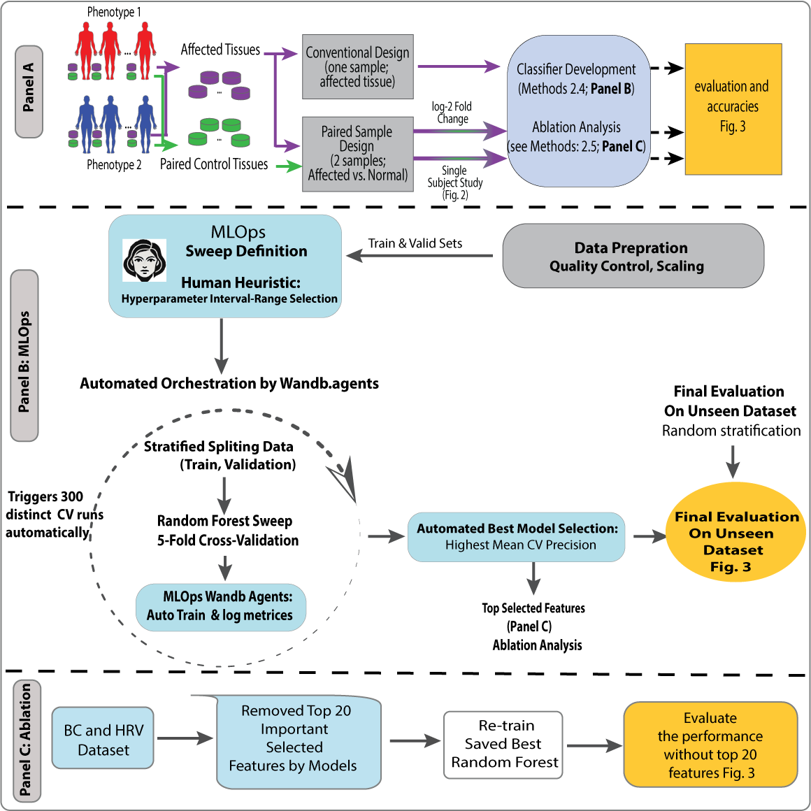
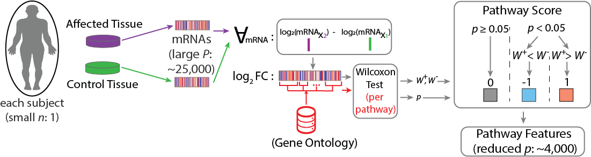
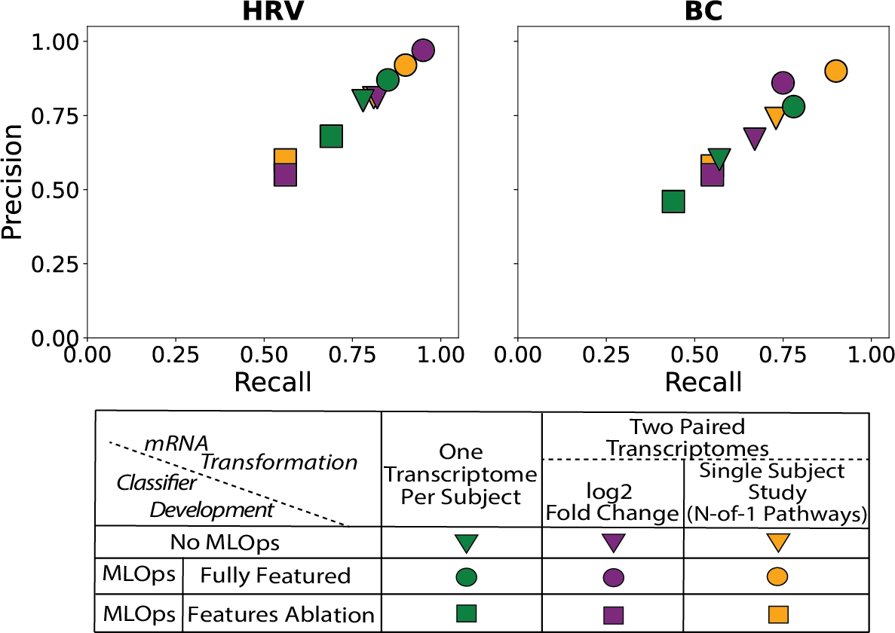

# MLOps-Micro-Cohort
# 🧬 Pathway MLOps for Rare Diseases
**A Paired-Sample, Pathway-Anchored MLOps Framework for Robust Transcriptome Classification in Small Cohorts**

This repository accompanies the publication:

> Shabanian et al., *Paired-Sample and Pathway-Anchored MLOps Framework for Robust Transcriptomic Machine Learning in Small Cohorts* (JMIR Bioinformatics, 2025)

---

## 🔍 Overview

High-dimensional transcriptomic data + small cohorts = overfitting.  
This project introduces a biologically informed classification pipeline for micro-cohorts (<30 subjects), integrating:

- 🧪 **Paired-sample transcriptomics** (e.g., tumor vs. normal)
- 🧬 **N-of-1 pathway analytics** (Wilcoxon-based GO enrichment per subject)
- ⚙️ **Reproducible MLOps** with [Weights & Biases](https://wandb.ai/) (versioning, sweep tuning, logging)
- 📉 **Retroactive Ablation** analysis to validate feature robustness

---

## ⚙️ Why MLOps?  

Traditional ML scripts often fail in biomedical research because they:  
- are **hard to reproduce**,  
- lack **version control**,  
- do not **scale** to multiple experiments, and  
- rarely include **monitoring or audit trails**.  

MLOps brings the discipline of DevOps to ML workflows. In this project, we use [Weights & Biases (W&B)](https://wandb.ai/) to implement:

- **Experiment Tracking** → Every run, dataset version, and hyperparameter is automatically logged.  
- **Automated Hyperparameter Sweeps** → YAML-based sweeps ensure reproducible model optimization.  
- **Code & Data Versioning** → Ensures that exact models can be reconstructed months or years later.  
- **End-to-End Automation** → From preprocessing, training, validation, to deployment — all orchestrated programmatically.  
- **Continuous Monitoring** → Performance metrics (accuracy, precision, recall) and feature importances are tracked in real time.  

➡️ In complex biomedical ML projects, MLOps provides **scalability, transparency, and accountability**.  

---

## 📊 Case Studies  

<!--  -->

<!--  -->

---

## 📈 Results  

---

## 🚀 How to Cite

@article{shabanian2025pathway,
  title={Paired-Sample and Pathway-Anchored MLOps Framework for Robust Transcriptomic Machine Learning in Small Cohorts},
  author={Shabanian, Mahdieh and Pouladi, Nima and Wilson, Liam S. and Prosperi, Mattia and Lussier, Yves A.},
  journal={JMIR Bioinformatics and Biotechnology},
  year={2025}
}

